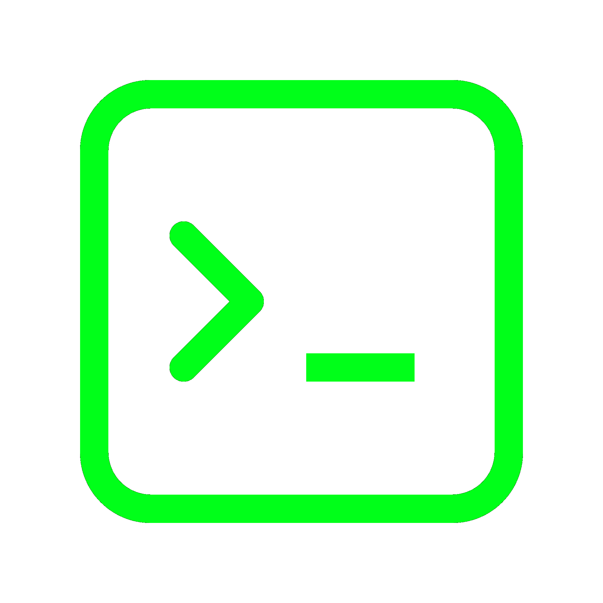

<h1>
  
  <samp>OS Toolkit</samp>
</h1>

`os-toolkit` is a Python-first OS utility repo for file system operations that need more **control**, **safety**, and **operational clarity** than ad-hoc shell commands.
It is a practical layer between raw `os`/`shutil` and a future agent-native ops toolkit.

## Setup

**Requirements:** Python 3.10+ on your PATH. No install step is required for the four root CLIs — they use the stdlib only.

```bash
git clone <your-repo-url> os-toolkit
cd os-toolkit
python file_transfer_pro.py --help
python disk_analyzer_pro.py --help
python smart_zip_pro.py --help
python analyze_pro.py --help
```

Run any tool the same way: `python <script>.py` plus its flags (see `--help` on each).

| Tool | Role |
|------|------|
| `file_transfer_pro.py` | Parallel copy (resume, dry-run, strategies) |
| `disk_analyzer_pro.py` | Directory usage tree |
| `smart_zip_pro.py` | Zip recommendations / optional archives |
| `analyze_pro.py` | `usage`, `profile`, or `compare` subcommands |

**Optional — `analyze_pro compare` only:** needs `numpy`, `pandas`, `scikit-learn`, and `tqdm` (`pip install numpy pandas scikit-learn tqdm`). `usage`, `profile`, and the other three CLIs do not need them.

**Tests (optional):** from the repo root, `pip install pytest` then `python -m pytest -m "not slow and not requires_ml" -q` (expects 20 passed, 1 deselected).

## Current phase

The repo is in **migration-first** mode:
- **Analysis pillar**: inspect, profile, and compare directory trees.
- **Transfer pillar**: copy and package data safely with resume/validation behavior.

Destructive behavior is never default; dry-run and explicit confirmation patterns are preferred.

## Repository layout

```text
os-toolkit/
  file_transfer_pro.py        # parallel copy (permanent CLI)
  disk_analyzer_pro.py        # usage tree (permanent CLI)
  analyze_pro.py              # usage | profile | compare subcommands
  smart_zip_pro.py            # zip recommendation + optional archives
  *_config.py                 # optional defaults (CLI overrides)
  runs/                       # generated analysis artifacts only
  os_toolkit/                 # shared implementation (not run directly)
    core/
    analysis/
    transfer/
```

## What is usable today

### 1) `file_transfer_pro.py`
Parallel file copy with resume, dry-run, optional verify, adaptive workers, and progress reporting.

```bash
python file_transfer_pro.py --source "<src>" --dest "<dst>"
```

### 2) `disk_analyzer_pro.py` and `analyze_pro.py`
Directory usage scanner (standalone) and unified analysis CLI.

```bash
python disk_analyzer_pro.py --path "<root>"
python analyze_pro.py usage --path "<root>"
python analyze_pro.py profile --root "<root>" --run-id myrun
python analyze_pro.py compare --old runs/myrun/old_features.csv --new runs/myrun/new_features.csv
```

### 3) `smart_zip_pro.py`
Recommends high-value folder-level zip targets and can create validated archives.

```bash
# dry-run recommendations (default)
python smart_zip_pro.py --root "<root>"

# approve per candidate
python smart_zip_pro.py --root "<root>" --interactive

# single-confirm batch execute
python smart_zip_pro.py --root "<root>" --execute
```

Common smart-zip flags:
- `--sensitivity low|normal|high`
- `--exclude "name1,name2"`
- `--output "<zip_output_dir>"` (must be outside `--root`)
- `--resume`, `--overwrite`, `--delete-originals`, `--workers`

## Configuration model

Each root script can load optional defaults from a colocated config file:
- `file_transfer_config.py`
- `disk_analyzer_config.py`
- `smart_zip_config.py`

Rule: **CLI arguments always win** over config defaults.

## Safety and design principles

- Python-only tooling.
- Stdlib-first dependency policy.
- No destructive defaults.
- Clear operator feedback (progress, counts, explicit warnings).
- Idempotent/re-runnable behavior where possible (resume/skip-valid flows).

## Architecture

Root `*_pro.py` scripts are the permanent user interface. `os_toolkit/` holds shared implementation only (never `python -m os_toolkit`). Analysis artifacts go under `runs/`.

Remaining roadmap: deepen analysis (duplicates, inter-usage), expand `transfer/`, add new domains (`dedupe`, `security`, `network`) with matching root tools.
