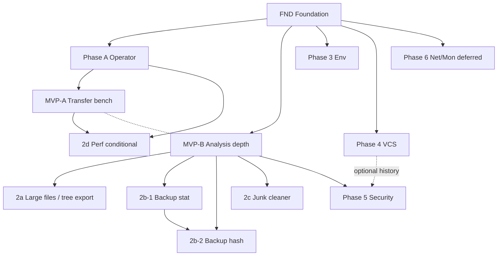

# os-toolkit — Phases (execution roadmap)

Live roadmap for **build order**, **KPIs**, and **shipped definitions**. Product vision and tool inventory: [`specs/HORIZON.md`](HORIZON.md). Per-tool guarantees: `specs/<tool>.md`.

---

## 1. Purpose and how to read this document

**PHASES.md** answers: *in what order do we build, with what KPIs, and what does “shipped” mean for each phase?* Update phase **Status** fields as work completes or scope shifts.

**HORIZON.md** is the comparatively static product contract (tools, domains, anti-goals). Items marked **speculative** in HORIZON §4G, **separate products** in §4H, and **open horizon** in §8 **do not appear here** until promoted in HORIZON and given a phase entry.

**Maturity in this file:** **High detail** for near-term phases (A, MVP-A, MVP-B, Tier 2, conditional perf). **Medium detail** for env, vcs, security. **Low detail** for deferred network/monitor scheduling (Phase 6).

---

## 2. Phase format (template)

Every phase entry uses:

```text
### Phase <id> — <short name>
Status: planned | in-progress | shipped | blocked
Depends on: <phase ids or "none">
Unlocks: <phase ids>

Objective
  One paragraph.

Features delivered
  User-visible capabilities (bullets).

Functions and modules
  path + one-line role (bullets).

KPIs
  Functional — verifiable claims
  Quality — tests tied to specs
  Performance — only when benchmarks apply; or "baseline only"
  Reuse — % formula or primitive introduction count

Success modes
  Shipped checklist + honest Known Limits in specs

How we plan to achieve this
  3–6 approach bullets

Risks and open questions
```

**Reuse KPI (when applicable):**

```text
Reuse % = (new lines that import/call os_toolkit.core.* or an existing
           domain module already shipped) / (total new lines added in phase)
```

When a phase **introduces** a core primitive, track instead: primitive name + which HORIZON tools will consume it (≥1 required before merge).

---

## 3. Phase index

Execution order (top to bottom). **FND** is already delivered on branch `feature/quality-engineering` (not pushed).

| Id | Name | Detail | Status | Depends on | Target output |
|----|------|--------|--------|------------|-----------------|
| **FND** | Foundation (migration + QE) | — | shipped (local) | none | `os_toolkit/`, specs, tests, benchmarks harness |
| **A** | Operator tooling & bench infra | high | planned | FND | `justfile`, four-drive matrix, `specs/future-benchmarks.md` |
| **MVP-A** | Transfer benchmark on hardware | high | planned | A | JSONL results + `BENCHMARKS.md` transfer baselines |
| **MVP-B** | Analysis depth & dedupe | high | planned | FND | Per-file inventory, `dedupe_pro`, expanded compare |
| **2a** | Large files & tree export | high | planned | MVP-B | `large_files_pro`, `tree_export_pro` |
| **2b-1** | Backup check (stat/mtime) | high | planned | MVP-B | `backup_check_pro` stage 1 |
| **2b-2** | Backup check (hash verify) | high | planned | MVP-B, 2b-1 | `backup_check_pro` stage 2 |
| **2c** | Junk cleaner | high | planned | MVP-B | `junk_cleaner_pro` + `cleanup/` |
| **2d** | Perf bench promotion *(conditional)* | high | planned / deferred | A–2c | Promote harness docs or `perf_bench_pro` only if criteria met |
| **3** | Env tools | medium | planned | FND | `path_health_pro`, `time_drift_pro`, `env_check_pro` |
| **4** | VCS audit | medium | planned | FND | `git_repo_audit_pro`, `core/vcs.py` |
| **5** | Security | medium | planned | MVP-B | `secret_hunter_pro` |
| **6** | Network & monitor *(deferred schedule)* | low | planned | FND (+ processes for net/mon) | Scheduling TBD; see phase entry |

**Parallelism note:** **MVP-A** and **MVP-B** do not depend on each other; either can start after its prerequisites (A vs FND). Recommended **sequential ship** for review bandwidth unless owner parallelizes.

---

## 4. Phase entries

### Phase FND — Foundation (migration + quality engineering)

**Status:** shipped (local; 25 commits ahead of `origin/master`, not pushed)  
**Depends on:** none  
**Unlocks:** A, MVP-B, 3, 4, 6

**Objective**  
Establish `os_toolkit/` domains, thin root CLIs, product specs, pytest suite, and benchmark harness with function-call fairness—so later phases extend rather than replace.

**Features delivered**

- `file_transfer_pro`, `disk_analyzer_pro`, `smart_zip_pro`, `analyze_pro` (usage | profile | compare)
- `specs/` contracts for shipped tools
- `pytest` fast suite (20 tests); compare behind `requires_ml`
- `benchmarks/` synthetic runners (transfer, analysis, zip scan/score)

**Functions and modules**

- `os_toolkit/core/{paths,format,config}.py` — shared helpers
- `os_toolkit/analysis/*` — usage, profile, features, compare, runs, filters, name_similarity
- `os_toolkit/transfer/*` — copy, archive scan/zip, worker, strategies, verify
- `tests/test_*.py`, `benchmarks/run_*.py`, `benchmarks/devices.py`, `benchmarks/corpus.py`, `benchmarks/fetch_corpus.py`

**KPIs**

- **Functional:** All four root CLIs run end-to-end on a sample tree; `analyze_pro profile` writes under `runs/`; transfer dry-run performs no writes.
- **Quality:** `pytest -m "not slow and not requires_ml"` — 20 passed; each test file cites spec guarantees.
- **Performance:** Synthetic bench smoke passes; no hardware baseline yet (MVP-A).
- **Reuse:** N/A (foundation phase).

**Success modes**

- Self-contained on `feature/quality-engineering`; no `migration_pro/`; `runs/` gitignored.
- Specs match behavior; Known Limits document directory-only profile/compare inputs today.

**How we plan to achieve this**

- Already delivered on branch; HORIZON §4A marks tools **shipped**.

**Risks and open questions**

- Public push timing is owner decision (Section 6).

---

### Phase A — Operator tooling and bench infrastructure

**Status:** planned (prompt 3 execution)  
**Depends on:** FND  
**Unlocks:** MVP-A, 2d (partial)

**Objective**  
Give operators one command surface (`just`) and extend benchmarks for honest multi-drive measurement with physical-device tagging—without changing product tool semantics.

**Features delivered**

- `just test`, `just bench-*`, `just transfer/analyze/zip/disk -- …`, `just clean`, `just check`
- Four-drive `--drive-a` … `--drive-d` matrix for transfer (N²) and analysis (N within-drive scans)
- `specs/future-benchmarks.md` — resume, adaptive, strategy bench **plans only**
- AGENTS.md: Top-Down Intent Rule + dependency documentation rule (commit zero, before A code)

**Functions and modules**

- `justfile` — recipe catalog
- `benchmarks/matrix.py` — drive/scenario iteration
- `benchmarks/devices.py` — extended `physical_id`, `same_physical_device`
- `benchmarks/run_transfer.py`, `benchmarks/run_analysis.py` — matrix integration
- `requirements.txt`, `README.md` — deps + install just
- `specs/future-benchmarks.md` — planning doc

**KPIs**

- **Functional:** `just check` runs fast pytest + synthetic bench; with 1–4 drive paths, transfer emits JSONL with `same_physical_device`; analysis emits N scan records (not N²).
- **Quality:** No regression in existing 20 tests; bench runners remain non-asserting (measure only).
- **Performance:** No fixed “beat X%” target; establish tagged JSONL on owner hardware optional post-merge.
- **Reuse:** Target **≥60%** reuse (matrix imports `devices`, `corpus`; recipes are thin shell).

**Success modes**

- Commit 0 (AGENTS) then commits for justfile, matrix, future-benchmarks spec.
- `just --list` documents all recipes; README links just install.

**How we plan to achieve this**

- Commit 0: AGENTS doctrine only.
- `iter_transfer_scenarios` / `iter_analysis_scenarios` (N only); reject `cross` on analysis.
- Scratch dirs `bench_<utc>_<scenario>/` with `try`/`finally` + `atexit` cleanup.
- Default bench recipes use synthetic corpus when no drives passed.

**Risks and open questions**

- Windows vs Unix `just` shell (Section 6).
- Owner multi-drive smoke before treating Ch2 as publish-ready.

---

### Phase MVP-A — Transfer benchmark on real hardware

**Status:** planned  
**Depends on:** A  
**Unlocks:** 2d (baseline data); informs transfer tuning (not a code phase by itself)

**Objective**  
Run transfer benchmarks on real disks, record honest baselines for `file_transfer_pro` vs stdlib/OS tools, and publish summarized results for future comparison.

**Features delivered**

- Documented transfer benchmark runs on owner hardware (1–4 drives)
- `BENCHMARKS.md` (or equivalent committed summary) interpreting JSONL from `benchmarks/results/`
- Comparison includes `os_toolkit.transfer`, `shutil.copytree`, and `rsync`/`robocopy` when available

**Functions and modules**

- No new product modules required; uses `benchmarks/run_transfer.py`, `just bench-transfer`
- `BENCHMARKS.md` — human-readable summary artifact (new)

**KPIs**

- **Functional:** At least one full matrix run (owner-chosen N drives) completes; JSONL lines include `corpus_signature`, `same_physical_device`, `scenario_id`, `tool`, `wall_time_sec`, `bytes_per_sec`.
- **Quality:** Results reproducible on same machine + same corpus signature; `unverified` tag documented if `--ignore-manifest`.
- **Performance:** **Baseline only** — record bytes/sec per tool/scenario; **no mandatory “≥X% vs shutil”** unless owner adds a machine-specific footnote in `BENCHMARKS.md` (not a CI gate).
- **Reuse:** **≥80%** (execution via existing `parallel_copy` + bench harness).

**Success modes**

- `BENCHMARKS.md` committed with date, hardware description, drive layout, and caveats (partitioned HDD vs true multi-disk).
- No stub runners; no TODO in committed bench code paths used.

**How we plan to achieve this**

- `just bench-transfer -- --drive-a …` (and B/C/D as available).
- Summarize JSONL; note `same_physical_device: true` pairs explicitly.
- Do not fetch full corpus in this phase unless owner runs `just bench-fetch` separately.

**Risks and open questions**

- Hardware variance makes cross-machine % targets meaningless (by design).
- See Section 6: start MVP-B before or after owner review of MVP-A results.

---

### Phase MVP-B — Analysis depth and dedupe

**Status:** planned  
**Depends on:** FND  
**Unlocks:** 2a, 2b-1, 2b-2, 2c, 5

**Objective**  
Move analysis from directory rollups to **per-file** records (size, mtime, file-type, content hash); enable intra-tree duplicate detection, `dedupe_pro`, and compare inputs that can use fingerprints.

**Features delivered**

- Per-file rows in profile artifacts and/or parallel inventory pass
- `dedupe_pro` — duplicate groups within one tree
- `analyze_pro compare` — uses per-file or enriched features (not rollup-only)
- Byte-identical detection **within** a single tree

**Functions and modules**

- `os_toolkit/core/hashing.py` — BLAKE2 (stdlib) digest helper *(new primitive)*
- `os_toolkit/analysis/inventory.py` or extended `profile.py` / `features.py` — per-file capture
- `os_toolkit/analysis/dedupe.py` — duplicate grouping
- `dedupe_pro.py` — root CLI
- Updated `specs/analyze_profile.md`, `specs/analyze_compare.md`, new `specs/dedupe.md`

**KPIs**

- **Functional:** On a test tree with two identical files, `dedupe_pro` reports one duplicate group of size 2; profile/features include hash column or sidecar; compare loads new schema without silent fallback to rollup-only.
- **Quality:** New tests cite spec guarantees; existing 20 tests pass; new tests for hash + dedupe; compare ML tests still `requires_ml`.
- **Performance:** **No fixed wall-time target**; optional bench of inventory pass on `small/mixed` documented in `BENCHMARKS.md` analysis section if run.
- **Reuse:** Introduces **`hashing`** consumed by ≥3 HORIZON tools (dedupe, backup_check 2b-2, expanded compare); target **≥50%** reuse of `paths`, existing walker patterns.

**Success modes**

- Specs updated same commit as behavior (Spec Evolution Rule).
- Known Limits state what compare still does not do (e.g. cross-tree byte-identical **matching** may remain backup_check / future scope).

**How we plan to achieve this**

- Single walker pass or consolidated pass emitting file records.
- `hashing.py` only when digest needed (no speculative xxhash mandatory).
- Dedupe: hash bucket → report paths.
- Extend `flatten_profile` / CSV schema with documented columns.

**Risks and open questions**

- Schema migration for existing `features.csv` consumers.
- Cross-tree “find byte-identical file in tree B for each file in tree A” — **not** MVP-B unless explicitly scoped (backup_check stage 2 is path-pair oriented).

---

### Phase 2a — Large files and tree export

**Status:** planned  
**Depends on:** MVP-B  
**Unlocks:** none critical

**Objective**  
Ship two thin orchestrators over the MVP-B file inventory: ranked large-file report and documentation-oriented tree export.

**Features delivered**

- `large_files_pro` — top-N files, optional age filter
- `tree_export_pro` — JSON / Markdown / HTML tree export

**Functions and modules**

- `large_files_pro.py` — CLI
- `tree_export_pro.py` — CLI
- `os_toolkit/analysis/large_files.py` — query inventory
- `os_toolkit/analysis/tree_export.py` — renderers
- `os_toolkit/core/serialize.py` — shared writers *(likely new; second consumer with bench JSONL patterns)*

**KPIs**

- **Functional:** `large_files_pro` lists known-largest files on test corpus; `tree_export_pro` emits valid JSON/Markdown for small tree.
- **Quality:** Tests map to new specs; no regression in MVP-B tests.
- **Performance:** None required.
- **Reuse:** Target **≥70%** reuse (inventory + `format` + `paths`).

**Success modes**

- `specs/large_files.md`, `specs/tree_export.md` committed.

**How we plan to achieve this**

- Read MVP-B inventory; sort/filter in memory or streaming heap for top-N.
- Export templates minimal v1.

**Risks and open questions**

- `serialize.py` admission vs inline JSON in one tool only (reuse doctrine).

---

### Phase 2b-1 — Backup check (stat / mtime)

**Status:** planned  
**Depends on:** MVP-B  
**Unlocks:** 2b-2

**Objective**  
Ship **stage 1** of `backup_check_pro`: read-only report of missing, extra, and mtime/size drift between source and backup paths—without content hashing.

**Features delivered**

- `backup_check_pro` comparing two directory roots
- Report: missing in backup, extra in backup, metadata drift

**Functions and modules**

- `backup_check_pro.py` — CLI
- `os_toolkit/analysis/backup_check.py` — stat-level diff

**KPIs**

- **Functional:** Synthetic pair of trees: missing/extra/drift rows correct; **no deletes**.
- **Quality:** Tests per `specs/backup_check.md` stage-1 guarantees.
- **Performance:** None required.
- **Reuse:** **≥65%** (MVP-B inventory / path keys).

**Success modes**

- Spec documents stage 2 not yet available.

**How we plan to achieve this**

- Build file index by relative path + size + mtime from MVP-B capture.

**Risks and open questions**

- See Section 6: ship as separate phase from 2b-2 (recommended: **yes**, per HORIZON two-stage decision).

---

### Phase 2b-2 — Backup check (hash verification)

**Status:** planned  
**Depends on:** MVP-B, 2b-1  
**Unlocks:** none critical

**Objective**  
Add **stage 2**: content hash equality for matched paths; flag hash mismatch where paths exist but bytes differ.

**Features delivered**

- Hash verification pass integrated into `backup_check_pro`
- Content-equal / content-mismatch classification

**Functions and modules**

- Extend `os_toolkit/analysis/backup_check.py` — hash compare
- Reuses `os_toolkit/core/hashing.py`

**KPIs**

- **Functional:** Identical file under same relative path → equal; same path different bytes → mismatch.
- **Quality:** Stage-2 tests added; stage-1 tests still pass.
- **Performance:** Optional bench on small/mixed for hash pass duration (informational).
- **Reuse:** **≥75%** (`hashing` + stage-1 module).

**Success modes**

- Spec stage-2 guarantees merged; Known Limits for hash algorithm and sparse files.

**How we plan to achieve this**

- Hash only when size match or policy dictates; avoid double-read where possible.

**Risks and open questions**

- Large backup trees: runtime and interrupt/resume (future enhancement, not required for ship).

---

### Phase 2c — Junk cleaner

**Status:** planned  
**Depends on:** MVP-B  
**Unlocks:** none critical

**Objective**  
First **destructive** tool: reclaim space with **dry-run default** and explicit confirmation for deletes; normal vs aggressive policy sets.

**Features delivered**

- `junk_cleaner_pro` — scan + report reclaimable bytes
- Modes: **normal** (offline-regeneratable caches) / **aggressive** (+ `node_modules`, `.venv`, download caches)
- Dry-run produces **zero mutations**; delete requires confirm flag

**Functions and modules**

- `junk_cleaner_pro.py` — CLI
- `os_toolkit/cleanup/junk.py` — rules engine
- `os_toolkit/cleanup/policies.py` — pattern sets

**KPIs**

- **Functional:** Dry-run on tree with `__pycache__` reports candidates, deletes nothing; confirmed delete removes only selected paths.
- **Quality:** Tests prove dry-run zero mutation; adversarial: path outside root rejected.
- **Performance:** None required.
- **Reuse:** **≥55%** (`paths`, walker); new `cleanup/` domain justified.

**Success modes**

- `specs/junk_cleaner.md` with destructive guarantees and anti-goals alignment.

**How we plan to achieve this**

- Allowlist-driven patterns; no broad “delete unknown.”
- Two-phase: scan report → confirm → execute.

**Risks and open questions**

- Operator mistake on aggressive mode — mitigated by confirm + dry-run default.

---

### Phase 2d — Perf bench promotion (conditional)

**Status:** planned *(may defer to HORIZON speculative)*  
**Depends on:** A through 2c (evaluation gate)  
**Unlocks:** none

**Objective**  
If benchmarks infrastructure already covers perf needs, **promote** documentation or a thin `perf_bench_pro` wrapper; otherwise **defer** and keep `perf_bench_pro` speculative in HORIZON.

**Promotion criteria (all required):**

1. `benchmarks/` already records time-series or strategy/adaptive runs needed by `specs/future-benchmarks.md` implementation plan.
2. A separate root CLI would only duplicate `just bench-*` with no new capability.
3. Owner agrees promotion in chat or Section 6 answer.

**If promoted — features delivered**

- `BENCHMARKS.md` section for analysis/transfer/zip baselines
- Optional `just bench-report` summarizing JSONL — **only if** not duplicating manual steps

**If deferred**

- Update HORIZON `perf_bench_pro` remains speculative; no code shipped in 2d.

**KPIs**

- **Functional:** Clear operator doc for running and interpreting benches.
- **Quality:** N/A if doc-only.
- **Performance:** Baseline tables exist from MVP-A (+ optional MVP-B inventory bench).
- **Reuse:** Doc-only → N/A; wrapper-only → **≥90%**.

**Success modes**

- Either committed doc path **or** explicit defer note in PHASES + HORIZON unchanged.

**Risks and open questions**

- Scope creep into full `perf_bench_pro` product (avoid per HORIZON).

---

### Phase 3 — Env tools

**Status:** planned  
**Depends on:** FND  
**Unlocks:** none critical

**Objective**  
Establish `env/` domain with three small read-only (or probe-only) utilities: PATH health, clock drift, dev environment checklist.

**Features delivered**

- `path_health_pro` — duplicate/missing/shadowed PATH entries
- `time_drift_pro` — clock vs NTP offset report
- `env_check_pro` — tool versions, expected paths, credential **presence** only

**Functions and modules**

- `path_health_pro.py`, `time_drift_pro.py`, `env_check_pro.py`
- `os_toolkit/env/path_health.py`, `time_drift.py`, `env_check.py`

**KPIs**

- **Functional:** Each CLI runs on developer machine without error; produces human-readable report.
- **Quality:** One spec per tool; smoke tests per tool (lighter than MVP-B depth).
- **Performance:** None.
- **Reuse:** **≥60%** (`path_parts`, `cfg_get`, subprocess patterns).

**Success modes**

- Three specs; no mandatory new third-party deps.

**How we plan to achieve this**

- Stdlib/subprocess probes; no secret value reads in `env_check_pro`.

**Risks and open questions**

- NTP reachability varies by network — report failure honestly.

---

### Phase 4 — VCS audit

**Status:** planned  
**Depends on:** FND *(independent of MVP-B)*  
**Unlocks:** 5 (optional git history for secrets)

**Objective**  
Multi-repo git inspection and `--recommend-track` for untracked code-like directories; establish `vcs/` and `core/vcs.py`.

**Features delivered**

- `git_repo_audit_pro` — branch, ahead/behind, dirty, stale branches
- `--recommend-track` — suggest `git init` candidates

**Functions and modules**

- `git_repo_audit_pro.py`
- `os_toolkit/vcs/audit.py`
- `os_toolkit/core/vcs.py` — git subprocess helpers

**KPIs**

- **Functional:** On folder with 2+ git repos, report correct branch/dirty; on folder with code but no `.git`, recommend-track lists it.
- **Quality:** Tests with temporary git repos (fixture).
- **Performance:** None.
- **Reuse:** Primitive **`vcs`** for Phase 5 history mode.

**Success modes**

- `specs/git_repo_audit.md`; stdlib + git binary only.

**Risks and open questions**

- Git not installed — actionable error.

---

### Phase 5 — Security (secret hunter)

**Status:** planned  
**Depends on:** MVP-B *(walker maturity)*; optional 4 for history mode  
**Unlocks:** none

**Objective**  
Regex-based secret/credential discovery in working tree; optional git history scan via `core/vcs.py`.

**Features delivered**

- `secret_hunter_pro` — findings report with path/line
- Optional `--history` using vcs helpers

**Functions and modules**

- `secret_hunter_pro.py`
- `os_toolkit/security/patterns.py`
- `os_toolkit/security/scan.py`

**KPIs**

- **Functional:** Test fixture with fake API key string is reported; clean tree returns empty.
- **Quality:** Tests per spec; no network exfiltration.
- **Performance:** None for v1.
- **Reuse:** **≥50%** (inventory walker + optional `vcs`).

**Success modes**

- ML/embedding scanning **not** in scope (HORIZON).

**Risks and open questions**

- False positives — documented in Known Limits.

---

### Phase 6 — Network and monitor (deferred schedule)

**Status:** planned *(low detail — scheduling deferred)*  
**Depends on:** FND; **`core/processes.py`** before net/mon tools  
**Unlocks:** none scheduled

**Objective**  
Placeholder for HORIZON Tier 3–4 tools not scheduled in near-term roadmap: `port_finder_pro`, `dep_mapper_pro`, `process_tree_pro`, `resource_watch_pro`.

**Features delivered** *(when scheduled — not committed now)*

- As listed in HORIZON §4E–F

**Functions and modules** *(future)*

- `os_toolkit/network/*`, `os_toolkit/monitor/*`, `core/processes.py`
- Possible **second dependency exception:** `psutil` (owner decision per HORIZON §7)

**KPIs**

- Deferred until phase is promoted to high detail.

**Success modes**

- N/A until scheduled.

**Risks and open questions**

- `psutil` exception requires explicit owner approval before implementation.
- Overlap `process_tree_pro` vs `resource_watch_pro` — differentiate at spec time.

---

## 5. Cross-phase dependencies



| Relationship | Detail |
|--------------|--------|
| MVP-A ⊥ MVP-B | Independent; only organizational sequencing |
| 2a, 2b-1, 2c → MVP-B | Require per-file inventory |
| 2b-2 → MVP-B + 2b-1 | Requires `hashing` + stage-1 reports |
| 4 ⊥ MVP-B | VCS audit standalone |
| 5 → MVP-B | Uses mature walker; optional 4 for history |
| 6 ⊥ all | Deferred; needs `processes` primitive first |

---

## 6. Open scheduling questions

**Owner input requested (do not assume answers):**

| # | Question |
|---|----------|
| 1 | After MVP-A results are committed locally, should **MVP-B start immediately** or wait for an owner review window? |
| 2 | **2b-1 vs bundled 2b:** HORIZON locks two-stage delivery; PHASES recommends **separate phases 2b-1 and 2b-2** — confirm or merge into one phase with two commits. |
| 3 | **Phase 2d promotion:** What triggers promote vs defer? Proposed: all three criteria in Phase 2d entry must be met. |
| 4 | **First push to origin:** Single 29+ commit stack vs PR split (foundation+QE vs A+MVP-A vs MVP-B+Tier2)? |
| 5 | **`psutil` exception** for Phase 6: approve before any monitor phase moves to high detail? |

**Agent checks (no HORIZON edit required):**

| Check | Result |
|-------|--------|
| Phase ordering vs codebase | Sensible: A before hardware MVP-A; MVP-B before Tier-2 analysis tools. |
| KPI measurability | **MVP-A % beat shutil** intentionally **not** a gate (machine-specific); use baseline recording. Reuse % measurable via line attribution per Section 2. |
| perf_bench conditional | Appropriate; avoids duplicate CLI with `benchmarks/`. |
| HORIZON coverage | All non-speculative Tier 1–4 tools assigned; §4G/§4H/§8 excluded per scope. |
| HORIZON contradiction | None found. |

**KPI caveats flagged (honest measurement):**

- Cross-machine performance comparison requires matching `corpus_signature` and hardware footnotes.
- Reuse % is approximate (count lines importing/calling existing modules); exclude boilerplate CLI argparse if owner prefers adjusted denominator.

---

*Update this file when a phase ships: set Status, date, and link to commit or tag. Mirror tool status in HORIZON §4.*
